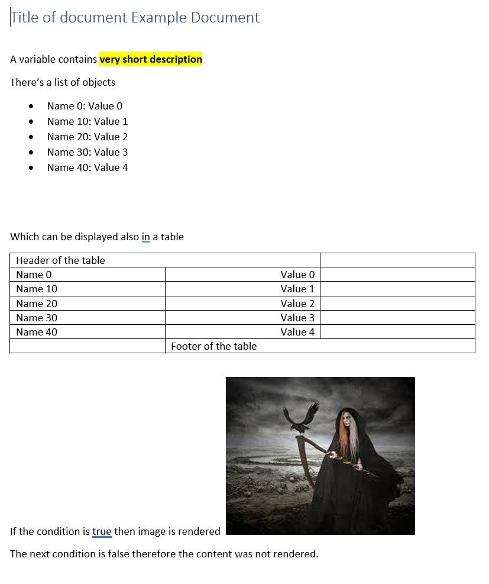

# Docx.TemplateEngine
Docx TemplateEngine is a tool for processing Docx templates. The user create a docx document with custom placeholders/markdown e.g. {order.totalPrice}.
It is necessary to create a corresponding Template model tree in the code:

```cs
ObjectModel documentModel = ObjectModel.Create(
    ("order", ObjectModel.Create(("totalPrice", "256.00")))
);
```

And process the template:

```cs
using FileStream templateStream = File.Open(inputFileName, FileMode.Open, FileAccess.Read);

DocumentEngine engine = new(NullLogger<DocumentEngine>.Instance);
byte[] docx = engine.Run(templateStream, documentModel, config);

File.WriteAllBytes("C:/Temp/processedDocument.docx", docx);
```

The styling of placeholders is taken into account and filled text takes over the styles.
It is possible to use placeholders for:
- values
- objects with values
- conditions (if condition is evaluated as false, the content is removed from document)
- images
- collections
    - in paragraphs
    - in tables (repeats rows within the collection markdown)

## Example

```cs
ObjectModel root = ObjectModel.Create(
    ( "title" , new ValueModel("Example Document") ),
    ( "description", new ValueModel("very short description")),
    ( "list",
       new CollectionModel(
            Enumerable.Range(0, 5).Select(i => ObjectModel.Create(
                ("name", new ValueModel($"Name {i * 10}")),
                ("value", new ValueModel($"Value {i}"))
            ))
        )
    ),
    (
        "nested",
        ObjectModel.Create(
            ("text", new ValueModel("Nested value"))
        )
    ),
    (
        "condition",
        new ConditionModel(true)
    ),
    (
        "image",
        this.LoadFromFile("sample.jpeg")
    )
);
```

The word template:


Filled document:


